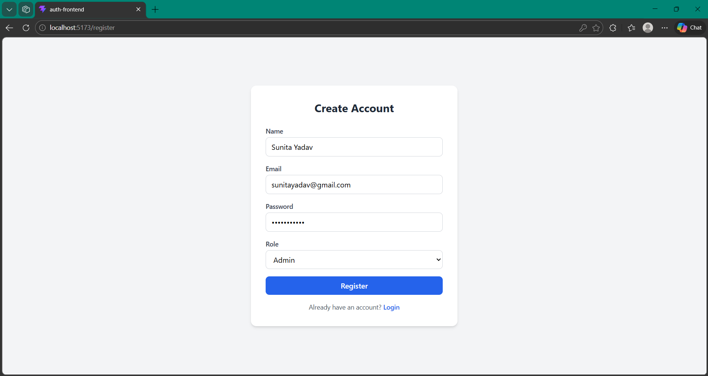
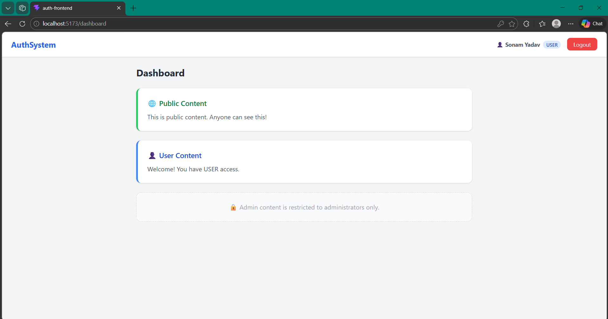
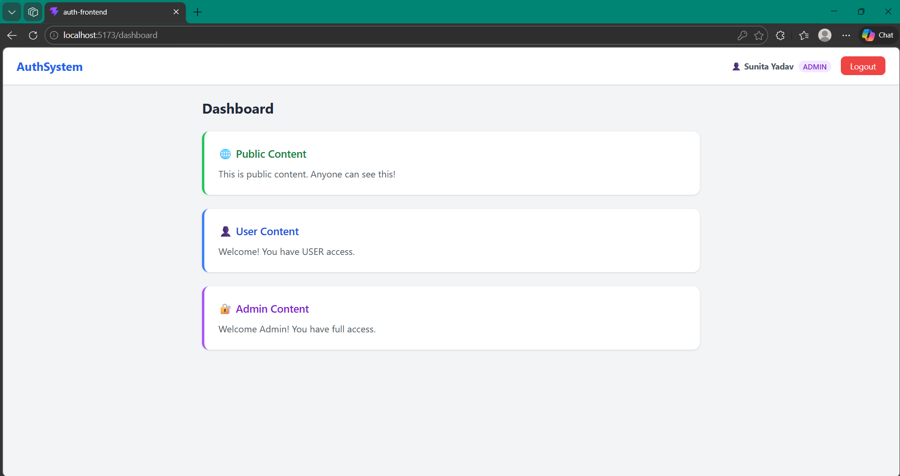

# Full Stack Authentication & RBAC System

## 📌 Overview

This project is a full-stack authentication system with role-based access control (RBAC).
It allows users to register, login, and access content based on their assigned role (USER / ADMIN).

The backend is built using Spring Boot with JWT authentication, and the frontend is built using React with TypeScript.

---

## 🎥 Demo Video

[Watch Here]((https://drive.google.com/file/d/1CHiWJbIFPhekoOGYgsBZep_LtpUTJdlk/view?usp=drive_link))

## ⚙️ Tech Stack

### Backend

* Java 17
* Spring Boot 3
* Spring Security + JWT
* Spring Data JPA (Hibernate)
* H2 Database
* Lombok
* Swagger (OpenAPI)

### Frontend

* React + TypeScript
* Vite
* React Router
* React Query
* Axios
* React Hook Form
* TailwindCSS

---

## 🚀 Features

### Authentication

* User Registration (Name, Email, Password, Role)
* User Login with JWT
* JWT is stored in localStorage
* Token attached to all protected API calls

### Authorization (RBAC)

* USER role → can access user content
* ADMIN role → can access admin content
* Role-based API protection implemented

### Frontend

* Register Page
* Login Page
* Dashboard Page
* Role-based UI rendering
* Protected routes

---

## 🔐 API Endpoints

* `/api/auth/register` → Register user
* `/api/auth/login` → Login and get JWT
* `/api/public` → Public content (no auth required)
* `/api/user` → User content (USER / ADMIN)
* `/api/admin` → Admin content (ADMIN only)

---

## 📂 Project Structure

```
authsystem/
│
├── auth-backend/                 #Spring boot 
│   ├── src/main/java/com/sonam/authsystem/
│   │   ├── config/               
│   │   │   └── SwaggerConfig.java
│   │   │
│   │   ├── controller/         
│   │   │   ├── AuthController.java
│   │   │   └── ApiController.java
│   │   │
│   │   ├── dto/                 
│   │   │   ├── AuthResponse.java
│   │   │   ├── LoginRequest.java
│   │   │   └── RegisterRequest.java
│   │   │
│   │   ├── entity/              
│   │   │   ├── User.java
│   │   │   └── Role.java
│   │   │
│   │   ├── repository/           
│   │   │   └── UserRepository.java
│   │   │
│   │   ├── security/             
│   │   │   ├── JwtFilter.java
│   │   │   ├── JwtUtil.java
│   │   │   └── SecurityConfig.java
│   │   │
│   │   ├── service/             
│   │   │   ├── AuthService.java
│   │   │   └── UserDetailsServiceImpl.java
│   │   │
│   │   └── AuthsystemApplication.java
│   │
│   ├── src/main/resources/
│   │   └── application.properties
│   │
│   ├── pom.xml
│   └── mvnw / mvnw.cmd
│
├── auth-frontend/                # React + TypeScript Frontend 
│   ├── src/
│   │   ├── api/                  
│   │   │   └── axios.ts
│   │   │
│   │   ├── assets/              
│   │   │   └── (images, icons)
│   │   │
│   │   ├── context/             
│   │   │   └── AuthContext.tsx
│   │   │
│   │   ├── pages/                
│   │   │   ├── LoginPage.tsx
│   │   │   ├── RegisterPage.tsx
│   │   │   └── DashboardPage.tsx
│   │   │
│   │   ├── types/               
│   │   │   └── auth.ts
│   │   │
│   │   ├── App.tsx               
│   │   ├── main.tsx              
│   │   └── index.css
│   │
│   ├── index.html
│   ├── package.json
│   ├── tailwind.config.js
│   └── vite.config.ts
│
├── .gitignore
└── README.md
```


---

## ▶️ How to Run

### Backend

1. Open backend in IntelliJ
2. Run the application
3. Server runs on: `http://localhost:8080`

### Frontend

1. Open frontend in VS Code
2. Run:

```
npm install
npm run dev
```

3. App runs on: `http://localhost:5173`

---

## 🧪 Testing

* Register a new user (USER / ADMIN)
* Login with credentials
* Verify role-based content on the dashboard

---

## 📸 Screenshots

### Login Page


### Registration Page


### User Dashboard


### Admin Dashboard


---

## 📌 Notes

* JWT is used for authentication
* Role-based access is handled using Spring Security

---

## 👩‍💻 Author

Sonam Yadav
